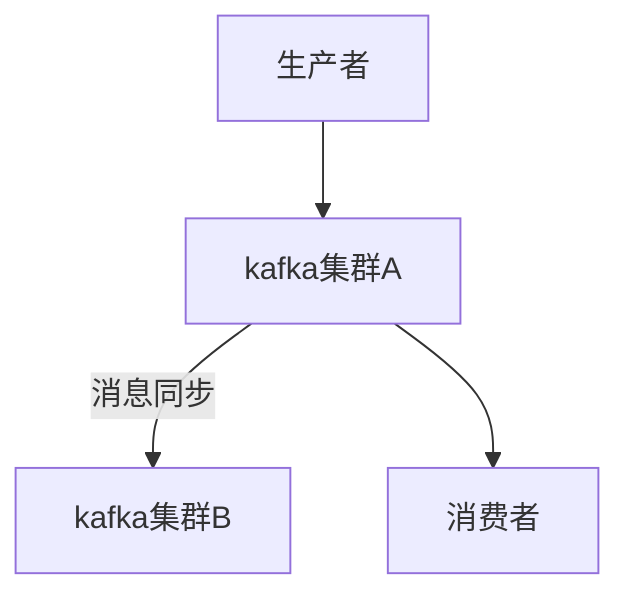
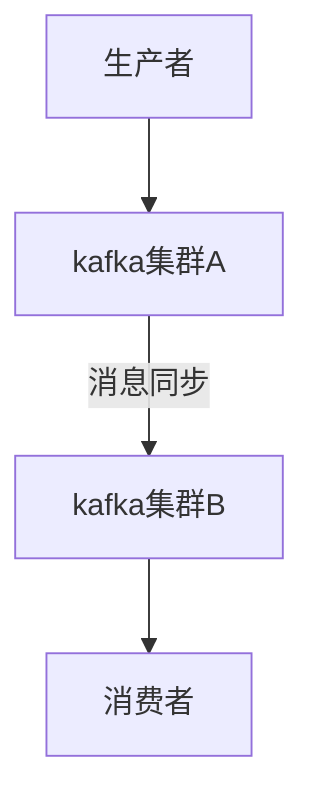
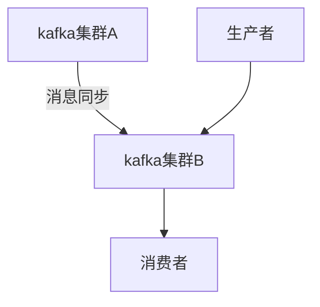

---

title:  "kafka迁移"
date:   2022-09-27 14:30:00 +0800
categories: java
typora-root-url: ..
published: true
---


# kafka迁移

假设要从Kafka-A迁移到Kafka-B，比如从自建集群迁移到云厂商的集群，或者从国内云迁移到国外云。

## 改kafka配置地址

先将生产者的地址改成B，等消费者消费完所有消息后，将消费者地址改成B。

消费者的信息在Kafka有记录，一般通过group和IP基本上能找齐，生产者的信息需要根据代码和配置找，稍微麻烦一点。

此方法难点在于梳理Kafka生产者和消费者依赖关系。如果kafka开启鉴权的话，可以不漏掉任何一个应用。

优点：
-   不需要改代码
-   操作简单，修改配置重启即可

缺点：
-   生产者和消费者依赖关系稍微复杂一点的话，应用重启顺序会很混乱，同一时间重启不现实。
-   漏消息：设想应用同时是生产者也是消费者，地址用的也是同一个，改地址重启的话可能会漏消费消息。
-   无法灰度

## 双写和双读

生产端：消息同时发送新、老集群，消费端：同时消费两个集群的消息

缺点：
-   代码改造太多，开发成本太高
-   发送端双写还好做，消费端双读不好做到幂等

## 消息同步

官方工具kafka-mirror-maker可以消费老集群指定topic的消息并重新发送到新集群，且发送的时候未指定分区。

### 初始状态


### 迁移消费者


### 迁移生产者


缺点：
- 这个方案的难点在计算每个分区的消费位点，如何同步和重置offset。
参考：https://blog.csdn.net/x763795151/article/details/121070563


## nacos开关方案
本质上也是改kafka配置地址，只不过将配置放到nacos配置中心中，通过 Nacos Server 和 spring-cloud-starter-alibaba-nacos-config 实现配置的动态变更，从而达到不重启应用切换kafka生产者和消费者连接地址。

样例：

```properties
producer.test_topic=kafkaB
consumer.test_topic=kafkaA
```

在前面的kafka使用方式中的代码中，生产者只需要将这个配置传进去，在每次send时判断一下topic==test_topic?, 若相等则使用nacos中的配置，若不相等则使用默认配置。消费者麻烦一点，由于是一个线程，需要加个监听器监听nacos配置是否有变动，若有变动，则重启相应topic的线程，使用新的地址拉取消息消费。由于properteis中的消费者和生产者地址是分开的，可以先切生产者，等消费者消费完A上的消息，再切消费者。
配合kafka的监控可以查看到消息积压情况，也可以按照topic进行灰度切换。如果迁移失败，也可以马上通过nacos应急回滚至kafka01。

这种切换的唯一缺陷就是需要所有应用全部升级到nacos的配置方案。