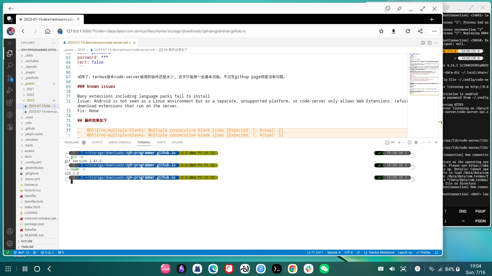

最近发现了一个好玩的东西，利用手机写代码。

## samsung dex

Samsung DeX 是通过将智能手机连接到外部显示器 (电视或显示器) 以便为用户提供桌面环境的服务。这项服务可以让您像电脑一样使用您的智能手机，您可以在大屏幕上便捷地使用您的智能手机功能。可以理解为一个Android桌面模式, 手机连上显示器，鼠标，键盘后可以用来轻办公，替代一部分笔记本的功能。 截止2023年7月15日，类似的还有华为手机额有桌面模式。

## termux

Termux是一个适用于 Android 的终端模拟器，其环境类似于 Linux 环境。 无需Root或设置即可使用。 Termux 会自动进行最小安装 - 使用 APT 包管理器即可获得其他软件包。
[Github地址](https://github.com/termux/termux-app#github)

### "Phantom+Process+killing"

Android 12以上的设备只要Termux进后台，运行桌面环境这类占用高CPU的程序，便有可能被Android系统杀死。此时Termux会抛出一个"Process completed (signal 9) - press Enter"信息。

这起因于一个新引进的系统机制，称作"Phantom Process Killing"，会限制后台程序占用。除了用悬浮窗让Termux挂在前台不触发Phantom Processes Killing以外，建议是用ADB命令永久停用"Phantom Process Killing"。

以下命令可能会对设备造成损坏，或导致后台程序失控。还好三星手机还有一个机制，检测到手机过热，会强制每20秒停止一个应用，开始以为是检测应用的cpu占用率，后来发现其实就是杀死正在运行的前台应用。长期使用下来最容易引起过热保护的是快充的同时运行大量应用。

Android手机打开ADB调试

Windows电脑至[Android官网](https://developer.android.com/studio/releases/platform-tools)下载ADB工具。如果没有电脑，可以试试[Termux跑ADB远程调试](https://ivonblog.com/posts/termux-wireless-adb/)

#### [Check ADB Devices](https://docs.andronix.app/android-12/andronix-on-android-12-and-beyond)

After the installation, confirm if you have your device connected via ADB

adb devices

#### Run the Commands

You should see your device listed in the output of the above command. Now run the following commands in the ADB shell

```bash
adb shell "/system/bin/device_config set_sync_disabled_for_tests persistent"

adb shell "/system/bin/device_config put activity_manager max_phantom_processes 2147483647"

adb shell settings put global settings_enable_monitor_phantom_procs false
```

## code-server

vscode的网页版服务，可以通过任何浏览器访问。

[termux安装code-server方式](https://coder.com/docs/code-server/latest/termux#installation)

### 问题1：gassip.h not found

```bash
pkg install krb5
```

### 问题2： pyt host unknown channel

```bash
sed -i -e 's|switch(process.platform)|switch("linux")|' /data/data/com.termux/files/usr/lib/node_modules/code-server/lib/vscode/out/vs/platform/terminal/node/ptyHostMain.js
```

安装完成之后可以，通过~/.config/code-server/config.yaml 这个文件修改登陆密码，端口。注意将绑定的IP从127.0.0.1改为0.0.0.0, 这样子手机开热点，其它设备也可以访问手机上运行的code-serve了。

```yaml
bind-addr: 0.0.0.0:8080
auth: password
password: ***
cert: false
```

试用了，termux版本code-server能用的插件还是太少, 近乎只能用一些基本功能，不过写githup page倒是没有问题。

## 强制使用linux插件

Create a JS script that patches process.platform:

```JSON
// android-as-linux.js
Object.defineProperty(process, "platform", {
  get() {
    return "linux"
  },
})
```

Then use Node's --require option to make sure it is loaded before code-server starts:

```BASH
NODE_OPTIONS="--require /path/to/android-as-linux.js" code-server
```

⚠️ Note that Android and Linux are not 100% compatible, so use these workarounds at your own risk. Extensions that have native dependencies other than Node or that directly interact with the OS might cause issues.

### known issues

when use cdr/code-server with termux on android.
search feature is not work because of missing bin/rg

update for fix search feature

```bash
# install ripgrep use pkg
pkg install ripgrep
#make a soft link use ln -s
#run this command in you code-server directory etc: yarn or npm's node_moudles

ln -s $PREFIX/bin/rg ./lib/vscode/node_modules/@vscode/ripgrep/bin/rg
```

#### termux-proot-distro

绕一点的解决方案也是有的，利用[proot-distro](https://github.com/termux/proot-distro)，安装一个接近完全版本的Linux，就可以用Linux版code-server，甚至还可以用vnc开图形界面，除了没有systemctl，services，docker等功能。

性能方面实测：proot<<termux

## 最终效果如下


