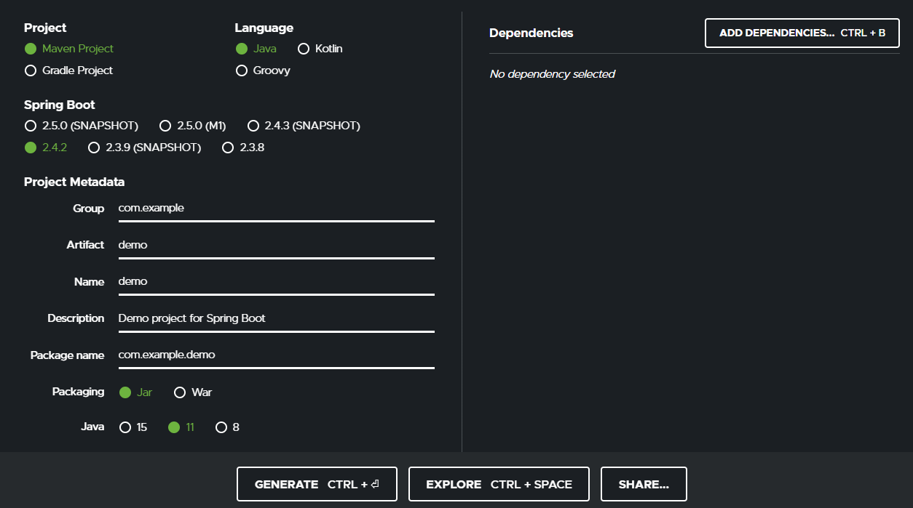
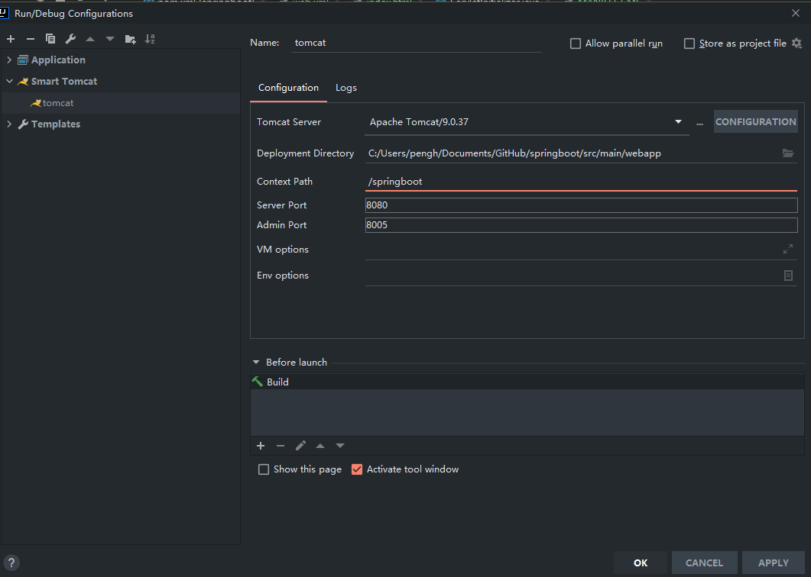

# Idea社区版配置
  
好的IDE绝对能让编程事半功倍。  
JetBrains公司的Intellij Idea是编写java项目的不二之选。苦于ultimate版本授权费太贵，用社区版加上插件配置也能作为出色的替代IDE。  
另外，jetrains有在校学生计划，凭edu邮箱可以申请education许可证。

## 下载
[官网下载地址](https://www.jetbrains.com/idea/download)

## 创建springboot项目
社区版无法直接创建springboot项目，所以我们要从[springboot官网](https://start.spring.io/)创建一个基础的springboot项目，选择所需的组件，下载代码zip包，使用idea打开。  


## Maven helper——依赖检查插件
  
社区版自带的maven缺少依赖检查，这个插件能够较好的显示依赖树，检查冲突。虽然还是不如旗舰版的图形化树形依赖好用，但功能也已经能用了。  
A must have plugin for working with Maven.  
Provides: 

-   easy way for analyzing and excluding conflicting dependencies
-   actions to run/debug maven goals for a module that contains the current file or on the root module
action to open terminal at the current maven module path
-   actions to run/debug the current test file. If maven-surefire-plugin is configured to skip or exclude the test, 'verify' goal will be used, see different configuration styles at https://github.com/harishkannarao/MavenSurefireFailsafeExamples

Usage: 
-   Right click in Editor | Run Maven 
-   Right click in Project View Toolbar | (Run|Debug) Maven 
-   CTRL + ALT + R - "Run Maven Goal" popup (you can use Delete key in the popup) 
-   CTRL + SHIFT + ALT + R - "Run Maven Goal on Root Module" popup (you can use Delete key in the popup)  
-   Customize goals: Settings | Other Settings | Maven Helper 
-   Define shortcuts: Settings | Keymap | Plug-ins | Maven Helper  
-   Open pom file, click on 'Dependency Analyzer' tab, right click in the tree for context actions.  

效果图：  


## smart tomcat——配置插件  
  
社区版缺少的tomcat配置选项可以使用该插件替代，配置好另外安装的tomcat路径既可以使用。  
This is for Tomcat Server plugin. The SmartTomcat will auto load the Webapp classes and libs from project and module, You needn't copy the classes and libs to the WEB-INF/classes and WEB-INF/lib. The Smart Tomcat plugin will auto config the classpath for tomcat server.  
The Smart Tomcat support Tomcat 6+  
效果图：


## database navigation——数据库查看插件
  
社区版缺少了datagrip数据库管理功能，可以用该插件替代部分功能。但是在删除功能上不如datagrip好用，也缺少了导入导出功能，并且无法在代码里显示sql字段名，表名错误提示。感觉不如用dbever 社区版，windows 10应用商店就可以下。  
Database development, scripting and navigation tool This product adds extensive database development and maintenance capabilities to the IntelliJ IDEA development environment and related products. Along with a qualified and IDE-compliant SQL and PL/SQL editor, it provides advanced database connection management, script execution support, database objects browsing, data and code editor, support for database compiler operations, method execution and debugging, database objects factory, as well as various navigation capabilities between all its components. See features overview on the support page.  
Supported Databases:

-   Oracle
-   MySQL
-   SQLite
-   PostgreSQL
-   Any JDBC compliant database (EXPERIMENTAL)  

效果图：  


## 其它插件推荐
- [MyBatisCodeHelper-Pro](https://github.com/gejun123456/MyBatisCodeHelper-Pro)——Mybatis插件
- Key Promoter X——快捷键提示插件  
- Checkstyle Idea——静态代码检查插件  
- QAPlug, -PMD, -Checkstyle, -FindBugs —— IDEA代码检查插件
- GenerateAllSetter——一款效率插件，它主要有以下功能： 

通过alt+enter对变量类生成对类的所有setter方法的调用
当两个对象具有相同的字段时生成一个转换器
当returnType为List Set Map时生成默认值
在所有getter方法上生成对assertThat的调用

- Json Parser——JSON解析器是一个用于验证和格式化JSON字符串的轻量级插件。
- Translation——中英文翻译工具
- SequenceDiagram——自动生成序列图插件
- 代码生成工具：CodeMaker
- 代码质量检查工具：SonarLint
- 单元测试测试生成工具：JUnitGenerator
- JSON转领域对象工具：GsonFormatPlus
- 字符串工具：String Manipulation
- CodeGlance——代码编辑区缩略图插件，可以快速定位代码
- GitToolBox——git工具箱
- Git Commit Template:使用模板创建commit信息
- Grep Console:控制台输出处理

## 其它问题解决方案
### IDEA运行报Command line is too long错误
原因：  
大多数操作系统具有最大的命令行限制，超过此值时，IDEA将无法运行应用程序。
当命令行长于32768个字符时，IDEA建议您切换到动态类路径。长类路径被写入文件，然后由应用程序启动器读取并通过系统类加载器加载。社区版缺少了shorten command line配置，可以在项目的.idea/workspace.xml文件中，找到  
```xml
<component name="PropertiesComponent">  

</componet>
```
添加一行  
```xml
<property name="dynamic.classpath" value="true" />
```

## devTool

在我们开发的过程中，我们经常会遇到修改一点点东西时候，都需要重启操作来生效。因此，spring boot为我们提供了一个devTool热更新工具，无需重启即可生效

##### pom.xml中引入相关jar

```xml

  <dependency>
      <groupId>org.springframework.boot</groupId>
      <artifactId>spring-boot-devtools</artifactId>
  </dependency>

```

IDEA使用：

- 修改了java类的地方，使用Ctrl+Shift+F9进行热更新
- 静态页面/模板页面，使用Ctrl+F9进行热更新
- 快捷键使用后不生效？前往File-Settings-Compiler-Build Project automatically选项开始idea自动编译


[返回目录](https://zph-programmer.github.io)

* [上一篇 —— 无]()
* [下一篇 —— spring-boot-starter-logging日志配置](02-spring-boot-starter-logging日志配置.md)