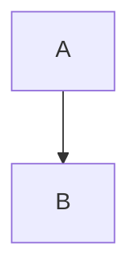
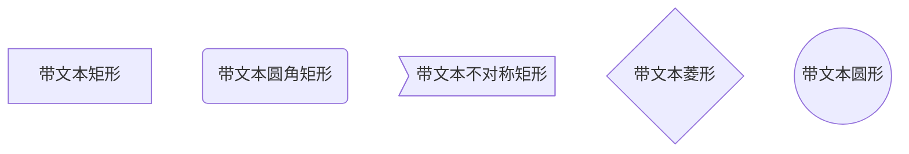
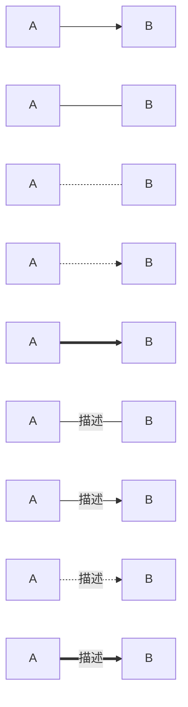
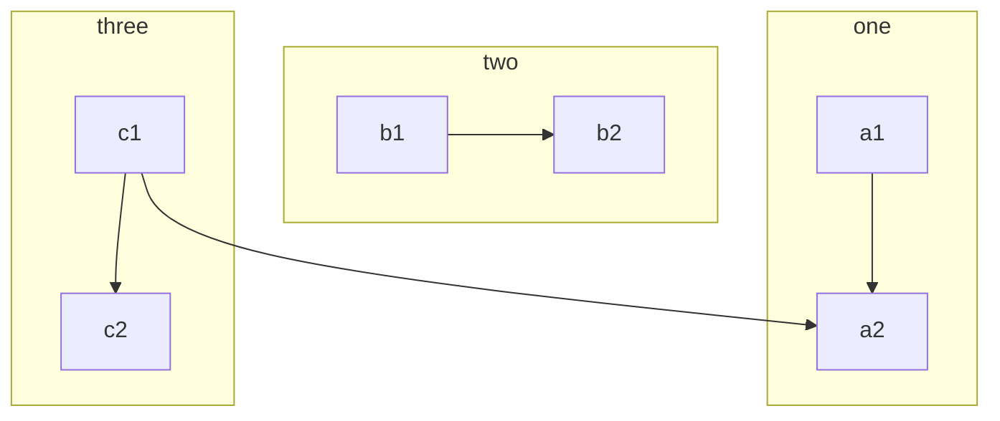
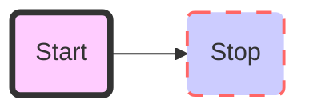
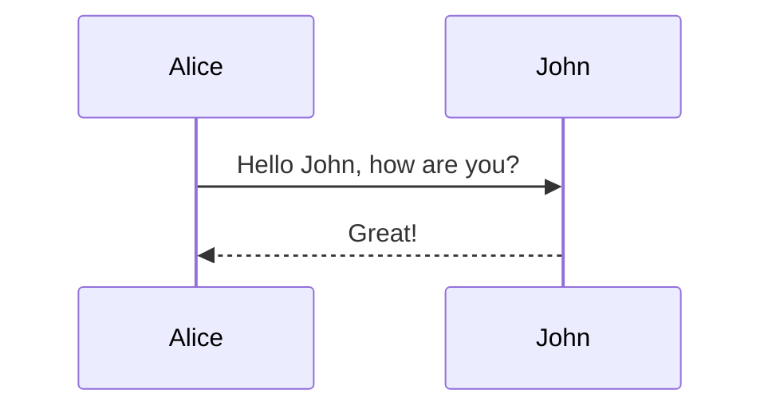
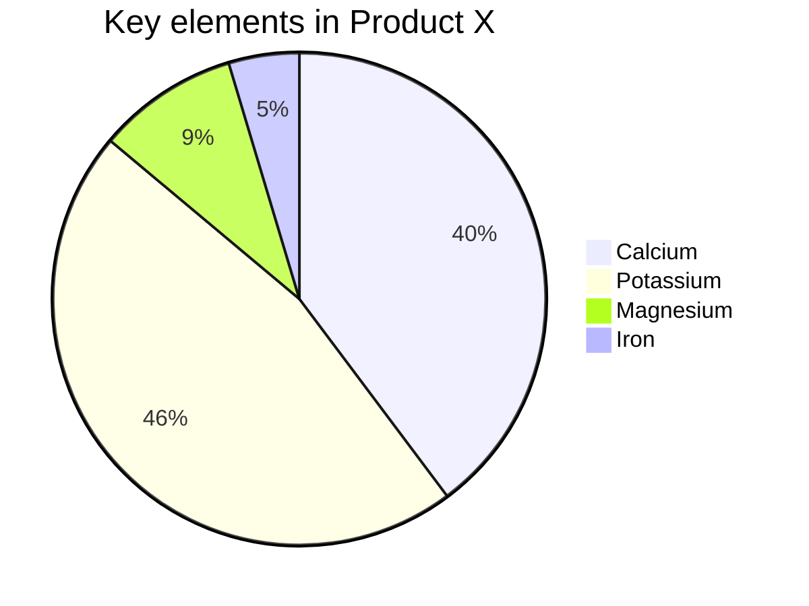

# 流程图

在写博客或者项目的文档的时候，往往都需要画流程图，比如用draw.io，Visio等所见及所得的画图工具。
但是这些可视化工具再给我们带来直观性的同时，也增加了操作的复杂度，需要精细地调整组件的大小和样式，
更多的时候，我们不是为了写一份漂亮的报告而画流程图，只是需要便捷地向他人分享自己的想法，在这样的需求下，代码生成流程图显然更适合。即所思及所得，常用的代码生成工具有graphviz等，markdown支持的流程图有flow和mermaid。这里，强烈推荐使用mermaid，语法简单易懂，图形简介美观。typora原生支持这种流程图。

[mermaid - Markdownish syntax for generating flowcharts, sequence diagrams, class diagrams, gantt charts and git graphs. (mermaid-js.github.io)](https://mermaid-js.github.io/mermaid/#/)

## 流程图方向

流程图总体分为横向和纵向两种。总共四个方向：T-上，B\D-下；L-左，R-右。使用方式就是横向的两两结合，纵向的两两结合。比如

- TB 从上到下
- BT 从下到上
- RL 从右到左
- LR 从左到右
- TD 同TB

方向演示：

~~~markdown

~~~

从上到下的展示效果：


## 流程图节点

下面展示的流程图节点有矩形 '[]'，圆角矩形 '()'，不对称矩形 '>]'，菱形 '{}'，圆形 '(())'。在每个节点前面需要唯一标识该节点ID。后面如果使用同一个节点，只用指明ID即可。

#### 基本图形

- id + [文字描述]矩形
- id + (文字描述)圆角矩形
- id + >文字描述]不对称的矩形
- id + {文字描述}菱形
- id + ((文字描述))圆形

如下示例：

```markdown
​```mermaid
graph TD
    a1[带文本矩形]
    a2(带文本圆角矩形)
    a3>带文本不对称矩形]
    b1{带文本菱形}
    c1((带文本圆形))
​```
```

效果如下



#### 节点之间的连接

- A --> B     A带箭头指向B

- A --- B      A不带箭头指向B

- A -.- B      A用虚线指向B

- A -.-> B    A用带箭头的虚线指向B

- A ==> B   A用加粗的箭头指向B

- A -- 描述 --- B       A不带箭头指向B并在中间加上文字描述

- A -- 描述 --> B      A带箭头指向B并在中间加上文字描述

- A -. 描述 .-> B      A用带箭头的虚线指向B并在中间加上文字描述

- A == 描述 ==> B  A用加粗的箭头指向B并在中间加上文字描述

  ``` markdown
  ​```mermaid
  graph LR
      A[A] --> B[B] 
      A1[A] --- B1[B] 
      A4[A] -.- B4[B] 
      A5[A] -.-> B5[B] 
      A7[A] ==> B7[B] 
      A2[A] -- 描述 --- B2[B] 
      A3[A] -- 描述 --> B3[B] 
      A6[A] -. 描述 .-> B6[B] 
      A8[A] == 描述 ==> B8[B] 
  ​```mermaidf
  ```

  



#### 子流程图

格式

```ruby
subgraph title
    graph definition
end
```

##### 示例


~~~markdown

~~~


#### 自定义样式

语法：style id 具体样式 。 参考css基本知识。

##### 示例

~~~markdown

~~~


## 其它

mermaid还支持时序图，状态图，类图，甘特图，饼图。

饼图使用 `pie` 表示，标题下面分别是区域名称及其百分比。

### **时序图**

语法解释：`->>` 代表实线箭头，`-->>` 则代表虚线。




### **状态图**

语法解释：`[*]` 表示开始或者结束，如果在箭头右边则表示结束。


### **饼图**




## Github Pages支持

很遗憾，Github pages是使用jekyll生成的html来显示页面的，jekyll虽然有插件jekyll-mermaid 插件，但是githup pages有自己的插件白名单[Dependency versions](https://pages.github.com/versions/)。解决方案，直接本地生产html文件放上去就行了。
