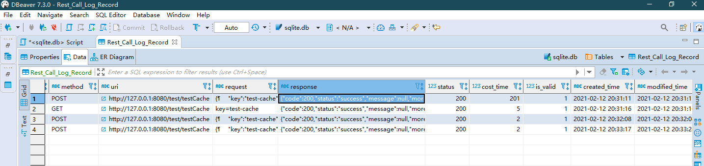

# Springboot使用mybatis连接SQLite
以下所有内容均可在[springboot-demo](https://github.com/zph-programmer/springboot)中找到。

## 所需依赖
在maven pom文件中引入所需依赖
```xml
<!-- https://mvnrepository.com/artifact/org.mybatis.spring.boot/mybatis-spring-boot-starter -->
<dependency>
    <groupId>org.mybatis.spring.boot</groupId>
    <artifactId>mybatis-spring-boot-starter</artifactId>
    <version>2.1.4</version>
</dependency>
 <!-- https://mvnrepository.com/artifact/org.xerial/sqlite-jdbc -->
<dependency>
    <groupId>org.xerial</groupId>
    <artifactId>sqlite-jdbc</artifactId>
    <version>3.34.0</version>
</dependency>
```

## 向spring-boot-start添加配置
启动类或mybatis配置类添加
@MapperScan("com.zph.programmer.springboot.dao")  
具体的url等路径根据实际情况填写，若是引用项目内的db文件，必须以jdbc:sqlite::resource: 开头，后面填写存放路径，一般放在static下的文件内。
```properties
spring.datasource.driver-class-name=org.sqlite.JDBC
spring.datasource.url=jdbc:sqlite::resource:static/sqlite/sqlite.db
spring.datasource.username=
spring.datasource.password=
mybatis.mapper-locations=classpath:static/mapper/*.xml
```

## 测试使用
在原先的过滤器中当中使用insert和update方法
需要注意的是，由于加载顺序，过滤器当中无法注入mapper等spring容器里的bean，我们需要另外通过工具获得。
```java
RestCallLogRecordMapper restCallLogRecordMapper= SpringBeanUtils.getBean(RestCallLogRecordMapper.class);

RestCallLogRecord record=new RestCallLogRecord();
...
record.setUri(url).setMethod(httpServletRequest.getMethod()).setRequest(requestParamsBuilder.toString()).setStatus(RestCallLogStatus.Start.getCode());
restCallLogRecordMapper.insert(record);
...
record.setResponse(body).setCostTime(end - start)
    .setStatus(httpServletResponse.getStatus());
restCallLogRecordMapper.updateByPrimaryKey(record);
```

## SpringBeanUtils
这个工具主要是为了通过应用上下文并获取相应的接口实现类
```java
import lombok.extern.slf4j.Slf4j;
import org.springframework.beans.BeansException;
import org.springframework.context.ApplicationContext;
import org.springframework.context.ApplicationContextAware;
import org.springframework.stereotype.Component;

@Slf4j
@Component
public class SpringBeanUtils implements ApplicationContextAware {

    private static ApplicationContext context;

    /**
     * 获取应用上下文并获取相应的接口实现类
     *
     */
    @Override
    public void setApplicationContext(ApplicationContext applicationContext) throws BeansException {

        SpringBeanUtils.context = applicationContext;

    }

    public static <T> T getBean(Class<T> clazz) {
        return context.getBean(clazz);
    }

    public static <T> T getBean(Class<T> clazz, String name) {
        return context.getBean(name, clazz);
    }
}

```

## xml文件里的sql语句
```xml
<?xml version="1.0" encoding="UTF-8"?>
<!DOCTYPE mapper PUBLIC "-//mybatis.org//DTD Mapper 3.0//EN" "http://mybatis.org/dtd/mybatis-3-mapper.dtd">
<mapper namespace="com.zph.programmer.springboot.dao.RestCallLogRecordMapper">
  <resultMap id="BaseResultMap" type="com.zph.programmer.springboot.po.RestCallLogRecord">
    <id column="id" jdbcType="INTEGER" property="id" />
    <result column="user_id" jdbcType="INTEGER" property="userId" />
    <result column="method" jdbcType="VARCHAR" property="method" />
    <result column="uri" jdbcType="VARCHAR" property="uri" />
    <result column="request" jdbcType="VARCHAR" property="request" />
    <result column="response" jdbcType="VARCHAR" property="response" />
    <result column="status" jdbcType="INTEGER" property="status" />
    <result column="cost_time" jdbcType="INTEGER" property="costTime" />
    <result column="is_valid" jdbcType="INTEGER" property="isValid" />
    <result column="created_time" jdbcType="VARCHAR" property="createdTime" />
    <result column="modified_time" jdbcType="VARCHAR" property="modifiedTime" />
  </resultMap>
  <insert id="insert" keyProperty="id" useGeneratedKeys="true" parameterType="com.zph.programmer.springboot.po.RestCallLogRecord">
    insert into Rest_Call_Log_Record (user_id, method,
      uri, request, response, 
      status, cost_time)
    values ( #{userId,jdbcType=INTEGER}, #{method,jdbcType=VARCHAR},
      #{uri,jdbcType=VARCHAR}, #{request,jdbcType=VARCHAR}, #{response,jdbcType=VARCHAR}, 
      #{status,jdbcType=INTEGER}, #{costTime,jdbcType=INTEGER})
  </insert>
  <update id="updateByPrimaryKey" parameterType="com.zph.programmer.springboot.po.RestCallLogRecord">
    update Rest_Call_Log_Record
    set user_id = #{userId,jdbcType=INTEGER},
      method = #{method,jdbcType=VARCHAR},
      uri = #{uri,jdbcType=VARCHAR},
      request = #{request,jdbcType=VARCHAR},
      response = #{response,jdbcType=VARCHAR},
      status = #{status,jdbcType=INTEGER},
      cost_time = #{costTime,jdbcType=INTEGER}
    where id = #{id,jdbcType=INTEGER}
  </update>
  <select id="selectByPrimaryKey" parameterType="java.lang.Integer" resultMap="BaseResultMap">
    select id, user_id, method, uri, request, response, status, cost_time, is_valid, 
    created_time, modified_time
    from Rest_Call_Log_Record
    where id = #{id,jdbcType=INTEGER}
  </select>
</mapper>
```

### 实际结果

```log
2021-02-12 20:31:11 |DEBUG |http-nio-8080-exec-1 |Logger.java:49 |org.mybatis.spring.SqlSessionUtils |Creating a new SqlSession
2021-02-12 20:31:11 |DEBUG |http-nio-8080-exec-1 |Logger.java:49 |org.mybatis.spring.SqlSessionUtils |SqlSession [org.apache.ibatis.session.defaults.DefaultSqlSession@425cec6b] was not registered for synchronization because synchronization is not active
2021-02-12 20:31:11 |DEBUG |http-nio-8080-exec-1 |HikariConfig.java:1066 |com.zaxxer.hikari.HikariConfig |HikariPool-1 - configuration:
2021-02-12 20:31:11 |DEBUG |http-nio-8080-exec-1 |HikariConfig.java:1098 |com.zaxxer.hikari.HikariConfig |allowPoolSuspension.............false
2021-02-12 20:31:11 |DEBUG |http-nio-8080-exec-1 |HikariConfig.java:1098 |com.zaxxer.hikari.HikariConfig |autoCommit......................true
2021-02-12 20:31:11 |DEBUG |http-nio-8080-exec-1 |HikariConfig.java:1098 |com.zaxxer.hikari.HikariConfig |catalog.........................none
2021-02-12 20:31:11 |DEBUG |http-nio-8080-exec-1 |HikariConfig.java:1098 |com.zaxxer.hikari.HikariConfig |connectionInitSql...............none
2021-02-12 20:31:11 |DEBUG |http-nio-8080-exec-1 |HikariConfig.java:1098 |com.zaxxer.hikari.HikariConfig |connectionTestQuery.............none
2021-02-12 20:31:11 |DEBUG |http-nio-8080-exec-1 |HikariConfig.java:1098 |com.zaxxer.hikari.HikariConfig |connectionTimeout...............30000
2021-02-12 20:31:11 |DEBUG |http-nio-8080-exec-1 |HikariConfig.java:1098 |com.zaxxer.hikari.HikariConfig |dataSource......................none
2021-02-12 20:31:11 |DEBUG |http-nio-8080-exec-1 |HikariConfig.java:1098 |com.zaxxer.hikari.HikariConfig |dataSourceClassName.............none
2021-02-12 20:31:11 |DEBUG |http-nio-8080-exec-1 |HikariConfig.java:1098 |com.zaxxer.hikari.HikariConfig |dataSourceJNDI..................none
2021-02-12 20:31:11 |DEBUG |http-nio-8080-exec-1 |HikariConfig.java:1098 |com.zaxxer.hikari.HikariConfig |dataSourceProperties............{password=<masked>}
2021-02-12 20:31:11 |DEBUG |http-nio-8080-exec-1 |HikariConfig.java:1098 |com.zaxxer.hikari.HikariConfig |driverClassName................."org.sqlite.JDBC"
2021-02-12 20:31:11 |DEBUG |http-nio-8080-exec-1 |HikariConfig.java:1098 |com.zaxxer.hikari.HikariConfig |exceptionOverrideClassName......none
2021-02-12 20:31:11 |DEBUG |http-nio-8080-exec-1 |HikariConfig.java:1098 |com.zaxxer.hikari.HikariConfig |healthCheckProperties...........{}
2021-02-12 20:31:11 |DEBUG |http-nio-8080-exec-1 |HikariConfig.java:1098 |com.zaxxer.hikari.HikariConfig |healthCheckRegistry.............none
2021-02-12 20:31:11 |DEBUG |http-nio-8080-exec-1 |HikariConfig.java:1098 |com.zaxxer.hikari.HikariConfig |idleTimeout.....................600000
2021-02-12 20:31:11 |DEBUG |http-nio-8080-exec-1 |HikariConfig.java:1098 |com.zaxxer.hikari.HikariConfig |initializationFailTimeout.......1
2021-02-12 20:31:11 |DEBUG |http-nio-8080-exec-1 |HikariConfig.java:1098 |com.zaxxer.hikari.HikariConfig |isolateInternalQueries..........false
2021-02-12 20:31:11 |DEBUG |http-nio-8080-exec-1 |HikariConfig.java:1098 |com.zaxxer.hikari.HikariConfig |jdbcUrl.........................jdbc:sqlite::resource:static/sqlite/sqlite.db
2021-02-12 20:31:11 |DEBUG |http-nio-8080-exec-1 |HikariConfig.java:1098 |com.zaxxer.hikari.HikariConfig |leakDetectionThreshold..........0
2021-02-12 20:31:11 |DEBUG |http-nio-8080-exec-1 |HikariConfig.java:1098 |com.zaxxer.hikari.HikariConfig |maxLifetime.....................1800000
2021-02-12 20:31:11 |DEBUG |http-nio-8080-exec-1 |HikariConfig.java:1098 |com.zaxxer.hikari.HikariConfig |maximumPoolSize.................10
2021-02-12 20:31:11 |DEBUG |http-nio-8080-exec-1 |HikariConfig.java:1098 |com.zaxxer.hikari.HikariConfig |metricRegistry..................none
2021-02-12 20:31:11 |DEBUG |http-nio-8080-exec-1 |HikariConfig.java:1098 |com.zaxxer.hikari.HikariConfig |metricsTrackerFactory...........none
2021-02-12 20:31:11 |DEBUG |http-nio-8080-exec-1 |HikariConfig.java:1098 |com.zaxxer.hikari.HikariConfig |minimumIdle.....................10
2021-02-12 20:31:11 |DEBUG |http-nio-8080-exec-1 |HikariConfig.java:1098 |com.zaxxer.hikari.HikariConfig |password........................<masked>
2021-02-12 20:31:11 |DEBUG |http-nio-8080-exec-1 |HikariConfig.java:1098 |com.zaxxer.hikari.HikariConfig |poolName........................"HikariPool-1"
2021-02-12 20:31:11 |DEBUG |http-nio-8080-exec-1 |HikariConfig.java:1098 |com.zaxxer.hikari.HikariConfig |readOnly........................false
2021-02-12 20:31:11 |DEBUG |http-nio-8080-exec-1 |HikariConfig.java:1098 |com.zaxxer.hikari.HikariConfig |registerMbeans..................false
2021-02-12 20:31:11 |DEBUG |http-nio-8080-exec-1 |HikariConfig.java:1098 |com.zaxxer.hikari.HikariConfig |scheduledExecutor...............none
2021-02-12 20:31:11 |DEBUG |http-nio-8080-exec-1 |HikariConfig.java:1098 |com.zaxxer.hikari.HikariConfig |schema..........................none
2021-02-12 20:31:11 |DEBUG |http-nio-8080-exec-1 |HikariConfig.java:1098 |com.zaxxer.hikari.HikariConfig |threadFactory...................internal
2021-02-12 20:31:11 |DEBUG |http-nio-8080-exec-1 |HikariConfig.java:1098 |com.zaxxer.hikari.HikariConfig |transactionIsolation............default
2021-02-12 20:31:11 |DEBUG |http-nio-8080-exec-1 |HikariConfig.java:1098 |com.zaxxer.hikari.HikariConfig |username........................none
2021-02-12 20:31:11 |DEBUG |http-nio-8080-exec-1 |HikariConfig.java:1098 |com.zaxxer.hikari.HikariConfig |validationTimeout...............5000
2021-02-12 20:31:11 |INFO  |http-nio-8080-exec-1 |HikariDataSource.java:110 |com.zaxxer.hikari.HikariDataSource |HikariPool-1 - Starting...
2021-02-12 20:31:11 |DEBUG |http-nio-8080-exec-1 |HikariPool.java:564 |com.zaxxer.hikari.pool.HikariPool |HikariPool-1 - Added connection org.sqlite.jdbc4.JDBC4Connection@56bb6002
2021-02-12 20:31:11 |INFO  |http-nio-8080-exec-1 |HikariDataSource.java:123 |com.zaxxer.hikari.HikariDataSource |HikariPool-1 - Start completed.
2021-02-12 20:31:11 |DEBUG |http-nio-8080-exec-1 |Logger.java:49 |org.mybatis.spring.transaction.SpringManagedTransaction |JDBC Connection [HikariProxyConnection@1815904983 wrapping org.sqlite.jdbc4.JDBC4Connection@56bb6002] will not be managed by Spring
2021-02-12 20:31:11 |DEBUG |http-nio-8080-exec-1 |BaseJdbcLogger.java:137 |com.zph.programmer.springboot.dao.RestCallLogRecordMapper.insert |==>  Preparing: insert into Rest_Call_Log_Record (user_id, method, uri, request, response, status, cost_time) values ( ?, ?, ?, ?, ?, ?, ?)
2021-02-12 20:31:11 |DEBUG |http-nio-8080-exec-1 |BaseJdbcLogger.java:137 |com.zph.programmer.springboot.dao.RestCallLogRecordMapper.insert |==> Parameters: null, POST(String), http://127.0.0.1:8080/test/testCache(String), {
    "key":"test-cache",
    "value":"测试缓存"
}(String), null, 0(Integer), null
2021-02-12 20:31:11 |DEBUG |HikariPool-1 housekeeper |HikariPool.java:421 |com.zaxxer.hikari.pool.HikariPool |HikariPool-1 - Pool stats (total=1, active=1, idle=0, waiting=0)
2021-02-12 20:31:11 |DEBUG |http-nio-8080-exec-1 |BaseJdbcLogger.java:137 |com.zph.programmer.springboot.dao.RestCallLogRecordMapper.insert |<==    Updates: 1
2021-02-12 20:31:11 |DEBUG |http-nio-8080-exec-1 |Logger.java:49 |org.mybatis.spring.SqlSessionUtils |Creating a new SqlSession
2021-02-12 20:31:11 |DEBUG |http-nio-8080-exec-1 |Logger.java:49 |org.mybatis.spring.SqlSessionUtils |SqlSession [org.apache.ibatis.session.defaults.DefaultSqlSession@2926eba8] was not registered for synchronization because synchronization is not active
2021-02-12 20:31:11 |DEBUG |http-nio-8080-exec-1 |Logger.java:49 |org.mybatis.spring.transaction.SpringManagedTransaction |JDBC Connection [HikariProxyConnection@445233853 wrapping org.sqlite.jdbc4.JDBC4Connection@56bb6002] will not be managed by Spring
2021-02-12 20:31:11 |DEBUG |http-nio-8080-exec-1 |BaseJdbcLogger.java:137 |com.zph.programmer.springboot.dao.RestCallLogRecordMapper.updateByPrimaryKey |==>  Preparing: update Rest_Call_Log_Record set user_id = ?, method = ?, uri = ?, request = ?, response = ?, status = ?, cost_time = ? where id = ?
2021-02-12 20:31:11 |DEBUG |http-nio-8080-exec-1 |BaseJdbcLogger.java:137 |com.zph.programmer.springboot.dao.RestCallLogRecordMapper.updateByPrimaryKey |==> Parameters: null, POST(String), http://127.0.0.1:8080/test/testCache(String), {
    "key":"test-cache",
    "value":"测试缓存"
}(String), {"code":200,"status":"success","message":null,"moreInfo":null,"data":"OK"}(String), 200(Integer), 201(Long), 1(Integer)
2021-02-12 20:31:11 |DEBUG |http-nio-8080-exec-1 |BaseJdbcLogger.java:137 |com.zph.programmer.springboot.dao.RestCallLogRecordMapper.updateByPrimaryKey |<==    Updates: 1
2021-02-12 20:31:11 |DEBUG |http-nio-8080-exec-1 |Logger.java:49 |org.mybatis.spring.SqlSessionUtils |Closing non transactional SqlSession [org.apache.ibatis.session.defaults.DefaultSqlSession@2926eba8]

```


* [返回目录](https://zph-programmer.github.io)
    * [上一篇 —— Mybatis-generator的使用](08-Mybatis-generator的使用.md)
    * [下一篇 —— Springboot使用security登录](10-Springboot使用security登录.md)